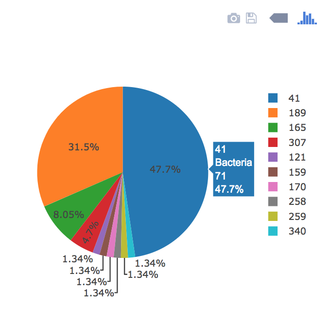

# Belly Button Biodiversity

The goal of this app was to build an interactive dashboard to explore the [Belly Button Biodiversity DataSet](http://robdunnlab.com/projects/belly-button-biodiversity/).

A Flask app deployed with Heroku. Can be viewed at https://belly-biodiversity-app.herokuapp.com/. 

## Plotly.js

Plotly.js was used to build the interactive charts for the dashboard.

* Everytime a sample is selected from the drop down the Sample Metadata, PIE Chart, and Bubble Chart are all repopulated with the information pertaining to that specific sample.

  

* The Metadata gives information specific to the selected sample.

  

* The Pie Chart was created to display the top 10 microbial species in OTU's (technically operational taxonomic units) for the selected sample. Each wedge is labeled with the unique ID with hovertext displaying the value and labels. 

  

* The Bubble Chart the different microbial species in OTU's for the selected sample. The x axis corresponds to the ID for the microbial species present and the y axis to the OTU value for the species. The bubble size corresponds to the OTU, color corresponds to the ID, and hovertext displays the labels. 

  

* Display the sample metadata from the route `/metadata/<sample>`

  * Display each key/value pair from the metadata JSON object somewhere on the page

* Update all of the plots any time that a new sample is selected.

* You are welcome to create any layout that you would like for your dashboard. An example dashboard page might look something like the following.

